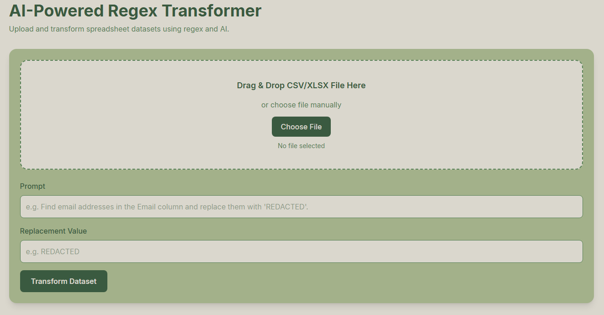
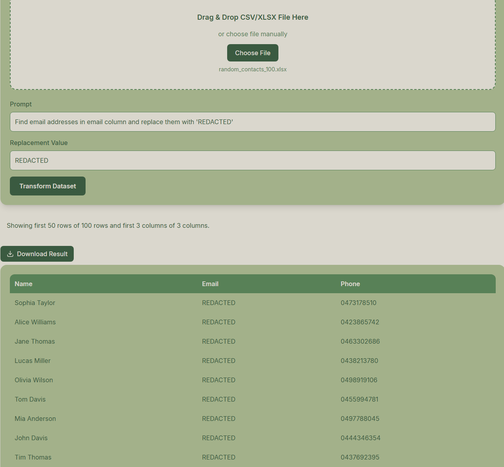
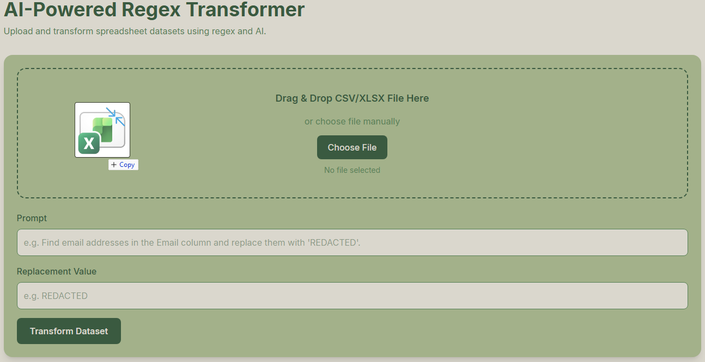

# RegexLeaf

RegexLeaf is an AI-powered web application that allows users to upload CSV or Excel datasets, describe patterns in natural language, and automatically transform data using regex patterns generated by OpenAI.


## Live Demo Link

Frontend: https://regex-leaf.vercel.app
Backend: https://regexleaf.onrender.com

## Features

- Upload CSV and XLSX files
- AI-powered regex generation using OpenAI
- Pattern matching and replacement
- Drag-and-drop file upload
- Large dataset support
- Download transformed datasets
- Live dataset preview
- Responsive modern UI

## Tech Stack

Frontend:

- React
- TypeScript
- Vite
- Tailwind CSS

Backend:

- Django
- Django REST Framework
- pandas
- OpenAI API

## Screenshots

Conveniently processing spreadsheet data:

Drag and drop feature:


## Setup Instructions

```bash
cd frontend
npm install
npm run dev
```

### Backend

```bash
cd backend
pip install -r requirements.txt
python manage.py runserver
```

## Environment Variables

Frontend `.env`

```env
VITE_API_URL=http://127.0.0.1:8000
```

Backend `.env`

```env
OPENAI_API_KEY=your_openai_api_key
```

## Future Improvements

- Transformation history
- Cloud storage
- Streaming progress update
